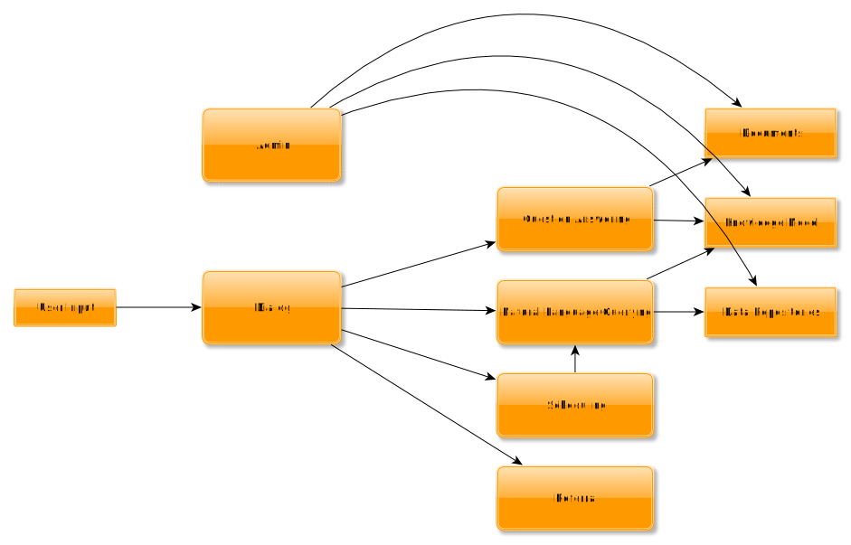

# AskDB

## Change begins with a Question

Internal business applications can be complex and changes are often carefully controlled. This can lead to frustration - often all users need is the answer to a simple question at the right time. Ask DB provides a way to build natural language question-answering into business applications.

Ask DB can be made available within your application through a simple text input, or through a voice interface. Questions are asked in the context of the record displayed.

* How many widgets has this customer bought
  * two widgets;  
     Widget A: 1st May 2018  
     Widget B: 12th June 2018

The system understands the terminology specific to your business by reading documents you provide. Questions may refer to this knowledge model directly
* How many days do they have to return printed goods?
  * See Terms and Conditions. Unwanted products must be returned within 28 days

The interface is conversational - where the form of the question is recognized but certain terms are not Ask DB can ask to clarify them
* is this customer eligible for the gold loyalty program
  * How can I tell if a customer is eligible for the gold loyalty program?
* They have to make at least one purchase every month for three months.
  * The customer has made the following purchases over the last three months.
...

Ask DB can also perform lightweight scheduling and reporting.
* Tell me when this customer purchases another widget
  * Ok, I will notify you when an order for widget is received from customer 123.

Questions can be responded to by generating and running a query, answering from a knowledge base, referring the user to a relevant report or document, or passing the question on to the appropriate person. Questions can later be analyzed in aggregate to identify application changes which would be most helpful to end users.

This project is at an early stage of development, but I believe the features described above are within the bounds of recent research results in machine learning. We aim to develop and package models for reuse, and provide tools to train these models for specific use cases.

----
## Design Overview

The user interacts with a dialog layer, which handles basic intent recognition. The input API would be kept very simple so it could be included in web-based applications and client forms with minimal impact. The input would include the text entered by the user, the source application, and optionally the user, the page within the application, and an identifier for the current record(s) displayed. 

### Dialog
Dialog with the user would be through scripts developed for tools like those from https://rasa.com/. These scripts would be kept simple,if intent is recognised as a question, it would be sent to both the Question Answering service and Natural Language Querying service, and the result with higher confidence would be used. Dialog around clarifying queries would be scripted in the dialog layer, but based on results from Question Answering - e.g. if the form of a question is recognised with high confidence, but parameters are not recognised.

### Admin

The Admin tool's main purpose is to provide a way to add documentation, data sources, and other training data to the system, but would also administer application access and security.

### Knowledge Model

The core of the system is the models trained on industry and organisation specific documentation. [Embedding models](https://en.wikipedia.org/wiki/Word_embedding) would capture differences in terminology and language usage within the business. These would form the basis for models used for Natural Language Queries and Question Answering. A key point is that the input is almost entirely natural language text - defining complex models should not be required.

### Natural Language Querying

Natural Language Querying is initially based on one of the models listed in https://github.com/salesforce/WikiSQL. These are trained to recognise natural language queries against readable tabular data, the training goal is to be able to generate queries against previously unseen tables without access to the data in the tables. The generated queries are limited to a single table, the SQL generated will not include joins, but identifying an appropriate table or view based on context as well as the question should be possible. In general it would make sense to cover a smaller number of business relevant denormalised views over tables, rather than trying to generate queries against physical tables.

### Question Answering

Question Answering would initally be based on https://github.com/facebookresearch/DrQA/ or a similar model. This model was trained to index wikipedia pages and answer questions on the content. Only explicit answers can be found, no reasoning is possible, but this should be sufficient for answering general questions on policy, procedures and where to find particular information.

----

## Longer Term Goals

### Graph Based Knowledge Model

Important concepts within the business would be described through a graph database generated from the models described above, and on user answers to clarification questions. This would allow more complex questions to be answered, but would also be useful in its own right for the business to understand the different understanding of business processes from different users.

### Multi-Language support

The main limitation for providing multi-language support is the limited training data and potentially implicit biases in existing models toward English.  

### Scheduling

Requests like "Tell me when..." and "Every day, tell me..." could be handled by interpreting the rest of the query, and repeating the query 

### Referral

Questions could be referred to an appropriate person or slack channel based on context and topic.
